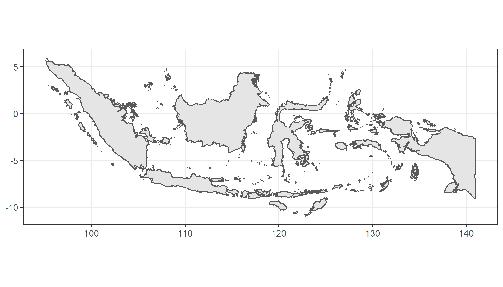
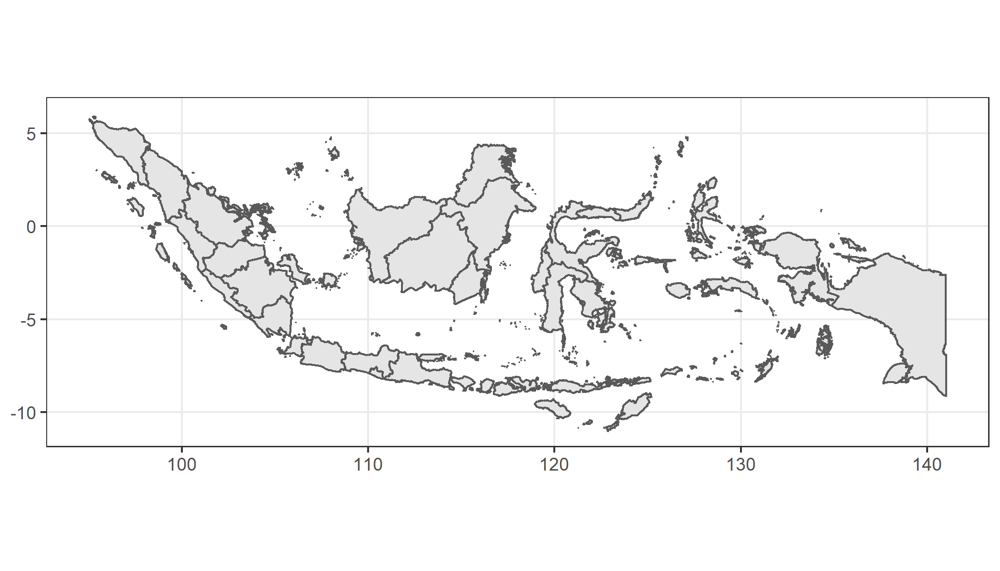

# Map Indonesia

Boundary polygons shapefile + R codes

## Raw Data

**Source:** [The Humanitarian Data Exchange](https://data.humdata.org/)

Source link for data [here](https://data.humdata.org/dataset/indonesia-administrative-boundary-polygons-lines-and-places-levels-0-4b). 

**Dataset name:** idn_adm_bps_20200401_SHP.zip (470.2M). Updated: 8 April 2020.

**Data description:** Indonesia administrative level 0 (country - negara), 1 (province - provinsi), 2 (city, district, regency - kota, kabupaten), 3 (sub-district - kecamatan, distrik) and 4 (village - desa, kelurahan, kampung, nagari, pekon or gampong) shapefiles

## Data

The data folder shows the shapefile output from the R codes, derived from the raw data. Obtain the raw data from the link above.

## Show Plot Output

#### Country Plot

Can take a while to run...

#### Province Plot

## License

[CC0-1.0 License](https://github.com/dvannanda/map-indonesia/blob/main/LICENSE.md)